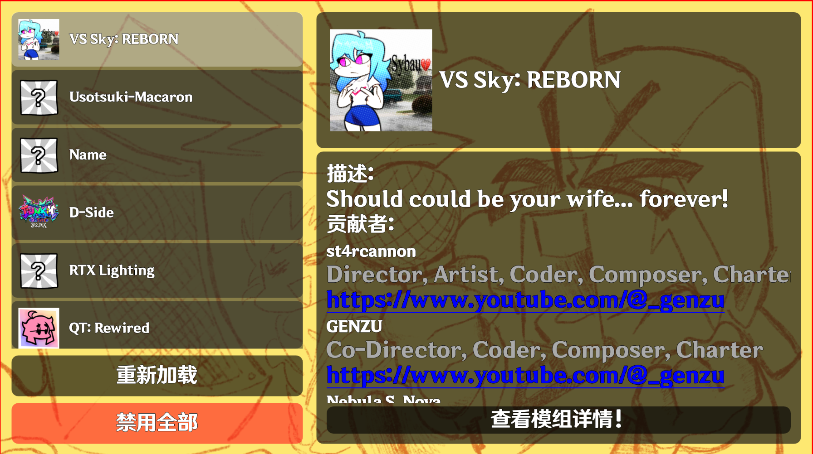

# Quark Engine - Based on Qt Framework

[**中文文档**](ZHREADME.md) | [**English Version**](README.md)

## Introduction:
- This is a project to recreate FNF (Friday Night Funkin') from scratch using Qt, and it's also my first open-source project, developed with C++.
- The main purpose is to learn C++ and Qt. No guarantees that it will be fully playable.
- Interest-driven learning, hence this project.
- Originally developed with UE5, but then strategically transitioned.
- Planned to be named **Quark Engine**
- Not based on any original engine, built entirely from scratch!
- *The code might be a bit messy.*

## 🛠 Roadmap:
- [x] Build mod parsing and mod selection interface from scratch
- [ ] Build basic game interface from scratch
- [ ] Build json/xml/png parsing modules from scratch
- [ ] Parse mod files and make the game playable from scratch
- [ ] Build compatibility scripts from scratch
- [ ] Successfully recreate the game

*Developed in spare time, expected to take one to two years.*

## ✅ How to Build:
Clone this project, copy it to any location on your disk, and open the CMakeList.txt file under the project directory with VS or CLion. You need to download the dependency libraries and set up the development environment according to the Qt documentation first. Dockerfile for one-click compilation will be available later.

## 🚀 Development Environment

&nbsp;&nbsp;&nbsp;&nbsp;&nbsp;&nbsp;

&nbsp;&nbsp;&nbsp;&nbsp;&nbsp;&nbsp;

* **IDE**: Visual Studio 2022 / Qt Creator / CLion (Recommended)
* **Language**: C++17
* **Framework**: Qt 6.9.2
* **Build System**: CMake / qmake
* **OS**: Linux recommended

*PS: VSCode also works, but configuration is tedious. Suitable for tinkerers.*

## 🤝 Contributors:
**Laokun**

## 📁 Project Structure
**Similar to the original FNF (official engine)**
* QML: UI description files
* src: Source code files
* src/include: Header files, including some implementations
* src/src: .cpp source code files
* docker: One-click pull and compile (not yet implemented)
* android: Java code and manifest files for Android APK building
* mod: Basic art resources for the game, taken from the official engine (does not include all playable weeks)
* main.cpp: Main entry point of the program. **You can start referencing from here.**
* rc: Windows icon files.

## 📄 License
GPL

## 📸 Screenshots
* Mod Selection Screen
  

## 📚 Libraries Used
* [miniaudio/stb_vorbis](https://miniaud.io/): Low-level audio playback
* [nlohmann/json](https://json.nlohmann.me/): JSON file parsing
* [pugixml](https://pugixml.org/): XML file parsing
* [semver](https://semver.org/): Semantic version string parsing

## 💬 Contact the Author
https://space.bilibili.com/533393738?spm_id_from=333.1007.0.0

## 📜 Acknowledgements
* [Friday Night Funkin'](https://github.com/ninjamuffin99/Funkin) - Thanks to the original author team for their great work.
* [Psych Engine](https://github.com/ShadowMario/FNF-PsychEngine/releases) - Source code reference and design patterns.
* And all the open-source community for providing technical inspiration.