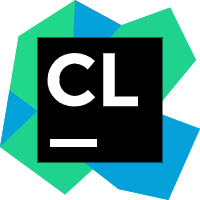
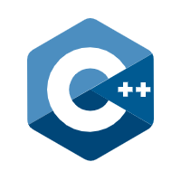

# Quark Engine 基于 Qt Framework

[**中文文档**](ZHREADME.md) | [English Version](README.md)

## 简介：
- 这是一个基于Qt做的从零开始复刻FNF的项目，也是我的第一个开源项目，使用C++ 开发。
- 主要目的是为了学习C++和Qt，并不保证能玩。
- 兴趣驱动学习，所以就有了这个项目。
- 原本使用UE5开发，最后战略转型。
- 准备定名为 **Quark Engine**
- 不基于任何原版引擎，纯手搓。
- *代码写的有点水。*

## 🛠 实现路线：
- [x] 手搓模组解析并构建选择模组界面
- [ ] 手搓基础游戏界面
- [ ] 手搓json/xml/png解析模块
- [ ] 手搓解析模组文件并开始可玩
- [ ] 手搓兼容脚本
- [ ] 复刻成功

*业余时间开发，前前后后预计需要一到两年的时间。*

## ✅ 如何构建：
克隆本项目后随便拷贝到磁盘的某个位置用VS或者CLion打开项目下的CMakeList.txt即可，建议使用Linux。

## 🚀 开发环境

&nbsp;&nbsp;&nbsp;&nbsp;&nbsp;&nbsp;&nbsp;&nbsp;

&nbsp;&nbsp;&nbsp;&nbsp;&nbsp;&nbsp;&nbsp;&nbsp;

* **IDE**: Visual Studio 2022 / Qt Creator / CLion（推荐）
* **语言**: C++17
* **框架**: Qt 6.9.2
* **构建系统**: CMake / qmake

*PS:VSCode也行，但是配置麻烦。适合喜欢折腾的玩家*

## 🤝 贡献者：
**Laokun**

## 📁 项目结构
类似原版FNF（官方引擎）

## 📄 许可证
别拿去卖钱就行

## 📸 截图
想看Hello World吗

## 💬 联系作者
https://space.bilibili.com/533393738?spm_id_from=333.1007.0.0

## 📜 鸣谢
* [Friday Night Funkin'](https://github.com/ninjamuffin99/Funkin) - 感谢原作者团队带来的伟大作品。
* 以及所有开源社区提供的技术灵感。